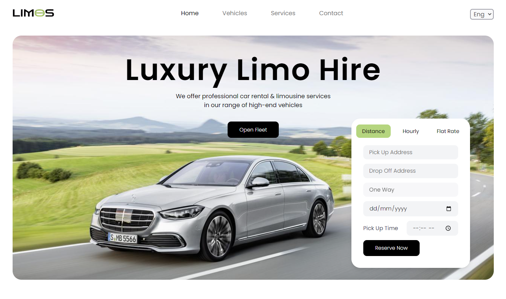
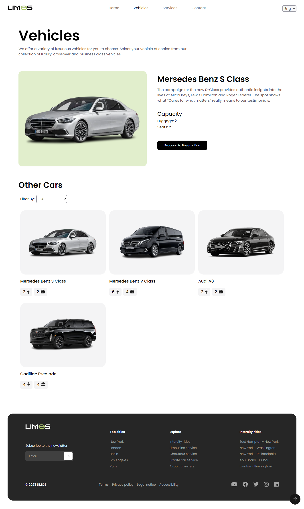
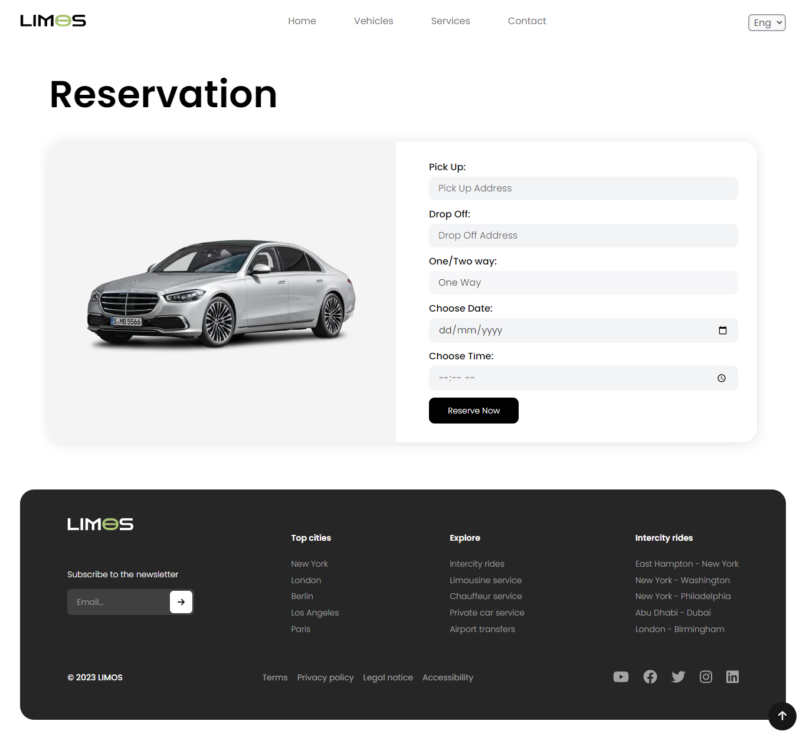

# LIMOS Rental Site

LIMOS is a website for luxury limousine rentals, designed to provide customers with a premium transportation experience for any occasion.

## Features

- Responsive design for optimal viewing on any device
- Use of React hooks to manage state and handle user input
- Customizable booking form with input validation and error handling
- A beautiful homepage containing all the relevant information
- Subtle animations across the website

## How to Use

1. Visit the LIMOS website at [limos](https://limos-rental-site.vercel.app/)
2. Browse the available limousine models and select the one that fits your needs

3. Fill out the booking form with your details and submit

4. Enjoy your premium transportation experience with LIMOS!

## Technology Stack

LIMOS is built using the following technologies:

- HTML
- React.js
- SCSS
- Tailwind CSS

## Contributing

I welcome contributions from the community! If you have any suggestions, bug reports, or feature requests, please open an issue on my GitHub repository.
